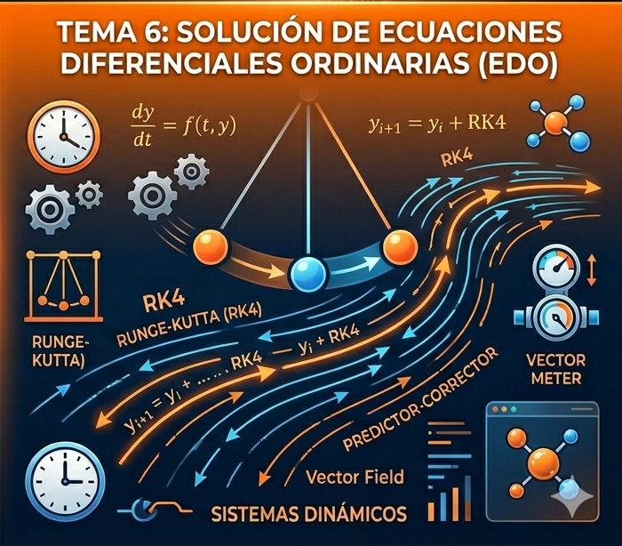

# Tema 6: Solución de Ecuaciones Diferenciales Ordinarias (EDO)

Las **Ecuaciones Diferenciales Ordinarias (EDO)** constituyen el lenguaje fundamental de la ciencia y la ingeniería, ya que permiten modelar cualquier sistema donde el cambio de una variable depende de su estado actual. En la práctica, la gran mayoría de los sistemas reales (como la aerodinámica de un vehículo o la cinética de una reacción química compleja) no poseen una solución analítica cerrada, lo que hace indispensable el uso de **métodos numéricos iterativos** para aproximar su comportamiento con alta precisión.

  

---

### 🔸 6.1 Métodos de Paso Único: De Euler a Runge-Kutta
Los métodos de paso único se caracterizan por su naturaleza **autoiniciada**: para calcular el siguiente valor $y_{i+1}$, el algoritmo solo necesita conocer el estado actual $(x_i, y_i)$. 

* **Método de Euler:** Es la base conceptual de todos los métodos. Se fundamenta en la expansión de la Serie de Taylor truncada en el primer término. Aunque su implementación es trivial, sufre de **inestabilidad numérica** si el tamaño de paso $h$ no es extremadamente pequeño, ya que asume que la pendiente es constante en todo el intervalo.
* **Métodos de Runge-Kutta (RK):** Estos métodos mejoran la aproximación de Euler evaluando la derivada en puntos intermedios del intervalo $h$. El **RK4** es particularmente potente porque utiliza un promedio ponderado de cuatro pendientes ($k_1$ a $k_4$):
    1.  $k_1$: Pendiente al inicio.
    2.  $k_2$ y $k_3$: Pendientes en los puntos medios (estimadas).
    3.  $k_4$: Pendiente al final del intervalo.
    Esto cancela los términos de error de menor orden, logrando una precisión que escala con $h^4$.

---

### 🔸 6.2 Métodos de Pasos Múltiples: Eficiencia y Memoria
A diferencia de los métodos RK, que "olvidan" el camino recorrido, los métodos de **pasos múltiples** almacenan la información de pasos anteriores para construir una trayectoria más suave y eficiente.

* **Esquemas Predictor-Corrector:** Son algoritmos de dos etapas diseñados para maximizar la estabilidad. 
    1.  **Predictor (Adams-Bashforth):** Utiliza un polinomio de extrapolación basado en puntos previos para "lanzar" una predicción del siguiente valor.
    2.  **Corrector (Adams-Moulton):** Refina ese valor mediante una fórmula de integración implícita. Este proceso se puede iterar hasta que la diferencia entre la predicción y la corrección sea menor a una tolerancia establecida, lo que permite controlar el **error local**.
* **Ventaja Computacional:** Son ideales para sistemas que requieren simulaciones prolongadas en el tiempo, ya que requieren menos evaluaciones de la función $f(x,y)$ que un RK4 para alcanzar una precisión similar.

---

### 🔸 6.3 Sistemas de Ecuaciones y Orden Superior
En el mundo real, los problemas rara vez consisten en una sola ecuación. Los fenómenos físicos suelen estar interconectados.

* **Reducción de Orden:** Cualquier ecuación diferencial de orden $n$ (como la ecuación de movimiento de un oscilador $m\ddot{x} + c\dot{x} + kx = F$) puede convertirse en un **sistema de $n$ ecuaciones de primer orden**. Esto permite que los mismos algoritmos (RK4 o Predictor-Corrector) resuelvan problemas de dinámica compleja, robótica y astrofísica.
* **Estabilidad en Sistemas Rígidos (Stiff):** Algunos sistemas tienen componentes que cambian a velocidades muy diferentes. Aquí se requiere el análisis de la **región de estabilidad** del método para evitar que la solución numérica "explote" o diverja de la realidad física.

---
